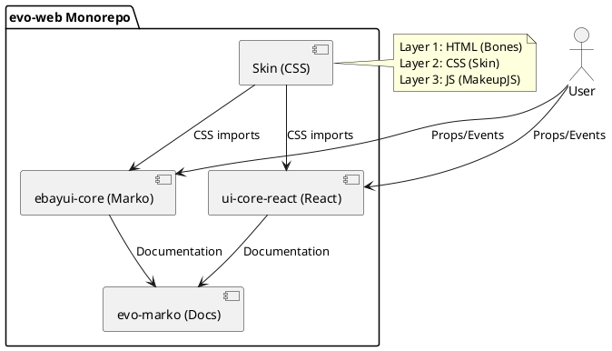
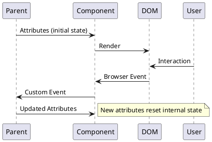

# Architecture Overview

## Purpose
This document provides the high-level architectural understanding of the evo-web monorepo: package structure, build flows, data patterns, and integration boundaries. Use this to understand where new components belong and how the system fits together.

## Three-Layer Component Architecture

evo-web implements progressive enhancement through three distinct layers:



**Layer 1 - Bones (HTML):** Semantic HTML5 structure providing baseline accessibility
**Layer 2 - Skin (CSS):** BEM-based styles using design tokens from @ebay/design-tokens
**Layer 3 - MakeupJS (JavaScript):** Framework-agnostic accessibility utilities (makeup-* packages)

## Package Structure

```
packages/
├── skin/                    # CSS foundation (SCSS → PostCSS → CSS)
│   ├── src/sass/           # Component SCSS modules
│   └── src/svg/            # Icon assets
├── ebayui-core/            # Marko components (92 components)
│   ├── src/components/     # Component implementations
│   │   └── components/     # Base components (dialog-base, notice-base, tooltip-base)
│   └── src/common/         # Shared utilities (17+ modules)
├── ebayui-core-react/      # React components (83 components)
│   ├── src/ebay-*/         # Component implementations
│   └── src/common/         # React utilities (10+ modules)
└── evo-marko/              # Documentation site (Marko 6)
```

## Component Data Flow

### Marko: Stateless Event-Driven Pattern


**Key Principle:** Marko components are stateless by default. Passing new attributes resets internal state. For persistence, parent components must synchronize state via event handlers.

### React: Standard Hooks Pattern
React components follow standard React patterns with hooks for state management. Props control behavior, events bubble up via callbacks.

## Build Flow

```
1. Lint (ESLint, Stylelint, Prettier)
2. Type Check (mtc for Marko, TypeScript for React)
3. Test (Vitest: browser + server for Marko, jsdom for React)
4. Build (package-specific compilation)
```

**Build Order:** skin → ebayui-core → ebayui-core-react → evo-marko

Each package must build successfully before dependent packages build.

## Component File Structure

### Marko Component (7-8 files)
```
ebay-{component}/
├── index.marko              # Template
├── component-browser.ts     # Client-side behavior
├── marko-tag.json          # Attribute definitions
├── style.ts                # Skin imports
├── {component}.stories.ts  # Storybook + interaction tests
├── examples/               # Usage examples
└── test/
    ├── test.browser.js     # Browser tests (Playwright)
    └── test.server.js      # SSR tests (Node)
```

### React Component (5-6 files)
```
ebay-{component}/
├── {component}.tsx         # Main component
├── types.ts               # TypeScript definitions
├── index.ts               # Exports
├── README.md              # Documentation
├── {component}.stories.tsx # Storybook stories
└── __tests__/
    └── *.spec.tsx         # Tests (jsdom)
```

## Integration Points

**CSS Integration:** Components import Skin CSS via `import "@ebay/skin/{component}"` (Marko) or consume pre-built CSS (React)

**Makeup Libraries:** Framework-agnostic utilities provide accessibility patterns:
- makeup-roving-tabindex (keyboard navigation)
- makeup-expander (expand/collapse)
- makeup-floating-label (input labels)
- makeup-keyboard-trap (modal focus)
- makeup-active-descendant (combobox patterns)

**Design Tokens:** Colors, spacing, typography from @ebay/design-tokens

**Floating UI:** @floating-ui/dom (Marko), @floating-ui/react for tooltip/popover positioning

## Where New Components Belong

- **Pure CSS component:** Add to `packages/skin/src/sass/{component}/`
- **Marko component:** Add to `packages/ebayui-core/src/components/ebay-{component}/`
- **React component:** Add to `packages/ebayui-core-react/src/ebay-{component}/`
- **Shared dialog/notice/tooltip logic:** Extend base components in `packages/ebayui-core/src/components/components/`

## Non-goals
- Implementation details of specific components (see component READMEs)
- Testing strategy details (see 01-system-testing-strategy.md)
- Build configuration specifics (see 05-system-build-deployment.md)
- Accessibility implementation patterns (see 00-domain-accessibility-patterns.md)
