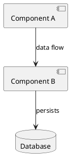

# AI Context Bank Generator

## ROLE

You are a senior engineer creating an AI Context Bank for repository.

## INPUTS

**MODE**: <PLAN|IMPLEMENT> (Default is PLAN)

- **PLAN**: Generate an implementation plan and assessment without creating actual context files
- **IMPLEMENT**: Generate the complete context files ready for use

**Repository**: <REPO_URL>

**Documentation & Requirements** (first-class inputs—treat as authoritative):

- Component Library Documentation: https://opensource.ebay.com/evo-web/
- Design System Documentation: https://playbook.ebay.com/design-system/components
- ADRs (Architecture Decision Records): `docs/adr`
- Key source files/paths: `packages/ebayui-core`, `packages/ebayui-core-react`, `packages/skin`

**Note**: All external documentation (JIRA, Google Docs, etc.) must be treated as authoritative sources equal to code. Read and reference them directly rather than making assumptions.

## GOAL

Create a minimal, high-signal context bank for AI-driven development (code generation, code review, bug fixes, refactors).
Optimise for local truth and avoid legacy pattern copying.

## HARD CONSTRAINTS (TOKEN SAFETY)

- Output at most 9 context files total:
  - 1 architecture file (ARCHITECTURE.md)
  - 4–6 system contexts
  - 2–3 domain contexts (create only 2 if uncertain)
- Each file must be 250–500 words.
- Prefer references to key files and links over long explanations.
- Do not invent file paths: if unsure, mark TODO with a guess and guidance on how to confirm.

## CONTEXT DEDUPLICATION CONTRACT (MANDATORY)

Treat context files like APIs with strict ownership.

## OWNERSHIP

- ARCHITECTURE.md owns: components, boundaries, high-level flows, where code goes.
- System contexts own: how to write code here (patterns, testing, logging, integrations).
- Domain contexts own: business rules, invariants, workflows, edge cases.

## HARD RULES

1) Do NOT restate information owned by another file.
2) If a concept already exists, reference it by file path instead of explaining it.
3) Every context file must include a "Non-goals" section listing what it does NOT cover.
4) If duplication is detected, choose ONE canonical owner file and delete duplicates elsewhere.

## WORK INPUTS YOU MAY USE

Use whatever repo material is available in the prompt/session (README, docs/, ADRs, API specs, folder structure, example files, PR notes).
If you lack repo access, produce a “skeleton bank” with TODO markers and a checklist of what to fill in.

## OUTPUT FORMAT (STRICT)

**The output format depends on the MODE selected:**

---

### IF MODE = PLAN

**WORKFLOW:**

1. Create folder: `ai-context-bank/`
2. Generate file: `ai-context-bank/implement-plan.md`

**Content for implement-plan.md:**

Include the following sections:

- SECTION 1: Assessment (full detail)
- SECTION 2: File plan (full detail)
- **IMPLEMENTATION ROADMAP**: A step-by-step guide explaining:
  - What information is needed to complete each context file
  - Which files/docs to review for each context
  - Validation checkpoints before generating files
  - Estimated effort and dependencies between contexts
  - Specific code patterns discovered from actual codebase files
  - References to documentation (JIRA, Google Docs, ADRs) reviewed

**Output**: Create only the `docs/ai/ai-context-bank/implement-plan.md` file. Do NOT generate actual context files (sections 3-8).

---

### IF MODE = IMPLEMENT

**WORKFLOW:**

1. Read `ai-context-bank/implement-plan.md` to understand the implementation roadmap
2. Generate all context files in the `ai-context-bank/` folder on the same branch
3. Create the complete context bank structure within the existing branch

**PREREQUISITE**: The `ai-context-bank/implement-plan.md` file must exist (created in PLAN mode). Use it as the authoritative guide for:

- Which context files to create
- What specific information to include based on actual codebase exploration
- Code patterns and conventions discovered during planning
- References to reviewed documentation

**OUTPUT**: Create all context files in `ai-context-bank/` on the same branch.

Return ALL sections (1-8) creating actual files in order:

### SECTION 1 — Assessment (short)

- System purpose (plain English)
- Main components/modules (bullets)
- Hot paths / complexity hotspots
- Testing reality today (what exists)
- Integrations list
- Recommended contexts:
  - System contexts (max 6): name + why
  - Domain contexts (max 4): name + why
- Risks: what is most likely to go wrong if contexts are wrong

### SECTION 2 — File plan

Provide a file tree for:

```bash
ai-context-bank/
README.md
PROMPT-TEMPLATES.md
ARCHITECTURE.md
contexts/
<list files you will create>
```

Limit total context files to the constraint above.

### SECTION 3 — Generate ARCHITECTURE.md

Rules:

- One page.
- No coding standards.
- No business rules.

Must include:

- System purpose
- Component map + boundaries
- Request/data flow (happy path)
- Where new code should go (decision rules)
- Sharp edges / risky areas
- Key files to study (paths or TODO)
- **PlantUML Diagram (REQUIRED)**: Include a PlantUML component diagram showing:
  - System components and their relationships
  - Data flow between components
  - External dependencies
  - Key boundaries
  - Use simple, clear notation for faster AI comprehension

Example PlantUML structure:



### SECTION 4 — Generate System Contexts (4–6 files)

**Generate these default 5 unless clearly irrelevant:**

- 03-system-repo-navigation.md
- 00-system-coding-standards.md
- 02-system-error-handling-logging.md
- 01-system-testing-strategy.md
- 04-system-dependency-integration.md
  Optionally add:
- 05-system-security-compliance.md (only if the repo touches auth/PII/secrets)

**Each system context file MUST include:**

- Purpose
- Ownership statement (what this file exclusively owns)
- Non-goals (explicit)
- Local truth rules (do/don't)
- Decision rules (if/then)
- Anti-patterns
- Key files to study
- References (paths to other contexts; do not restate)
- **PlantUML Diagram (OPTIONAL but recommended)**: Include when it significantly clarifies the concept:
  - For testing strategy: test flow, test pyramid
  - For error handling: error propagation flow
  - For dependency integration: integration points, API flows
  - Use sequence or activity diagrams for process flows
  - Keep diagrams simple and focused on the specific system concern

### SECTION 5 — Generate Domain Contexts (2–3 files)

First propose top 4 candidate domain contexts (name + why), then generate top 2 (or 3 if clearly needed).
Each domain file MUST include:

- Domain purpose
- Invariants (must-always-be-true)
- Workflow(s)
- Edge cases
- Non-goals (explicit)
- References to system contexts (no restatement)
- Key files/sources (paths or TODO)
- **PlantUML Diagram (OPTIONAL but recommended)**: Include when workflows or state transitions are complex:
  - For workflows: use activity or sequence diagrams
  - For state machines: use state diagrams
  - For business rules: use decision trees or activity diagrams
  - Focus on domain logic flow, not technical implementation
  - Keep diagrams at business-logic level for clarity

### SECTION 6 — README.md

Must include:

- What this is
- How to select the smallest context set per task
- Context ownership map (Topic → Owner file)
- Contribution rules (keep it small)
- Drift/duplication warning signs

### SECTION 7 — PROMPT-TEMPLATES.md

**Structure**: Each prompt template must follow this exact structure:

1. **ROLE**: Define who the AI is acting as
2. **CONTEXT**: Provide relevant context files and documentation
3. **REQUIREMENT**: State what needs to be accomplished
4. **INSTRUCTIONS**: Specific steps and guidelines to follow

**Generate templates for these task types:**

- Feature development
- Bug fix
- Refactor
- Add tests
- Code review

**Each template MUST:**

- Follow the ROLE → CONTEXT → REQUIREMENT → INSTRUCTIONS structure
- Instruct the user to include only ARCHITECTURE.md + 1–3 relevant context files
- Show how to reference context files by path (e.g., `@ai-context-bank/ARCHITECTURE.md`, `@ai-context-bank/contexts/00-system-coding-standards.md`)
- Include PlantUML diagram references when relevant
- Specify which context files are most relevant for each task type

**Template Example Structure:**

```markdown
# [Task Type] Template

## ROLE
You are a [specific role] for this codebase.

## CONTEXT
Read the following context files:
- @ai-context-bank/ARCHITECTURE.md
- @ai-context-bank/contexts/[relevant-context].md

## REQUIREMENT
[What needs to be accomplished]

## INSTRUCTIONS
1. [Specific step 1]
2. [Specific step 2]
...
```

### SECTION 8 — Deduplication report (required)

- List any concepts that risk duplication across files
- For each, name the canonical owner file
- Provide 5 “rewrite rules” to remove duplication (e.g. “replace paragraph with reference to X”)

## QUALITY BAR

### Truth from Source (MANDATORY)

- **NEVER ASSUME**: Read actual codebase files before making assertions about patterns, architecture, or conventions.
- **AVOID BIASES**: Do not project common framework patterns onto this codebase. Discover what actually exists.
- **First-class inputs**: Treat JIRA links, Google Docs, ADRs, and any attached documentation as authoritative sources equal to code.
- **Verify, don't infer**: If uncertain about a file path, pattern, or convention, mark it TODO with guidance on how to confirm—don't guess.

### Output Quality

- Clear, skimmable, direct.
- No generic boilerplate.
- Must read like instructions an engineer can follow.
- Every assertion must be traceable to a specific file, doc, or codebase observation.
- If you must assume despite exploring available sources, label it ASSUMPTION and add a TODO to verify.